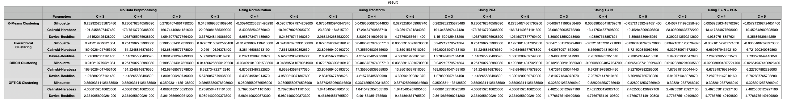

# Clustering Evaluation with PyCaret and scikit-learn

## Overview

This repository presents an in-depth analysis of clustering algorithms using PyCaret and scikit-learn on the Heart Disease dataset. The primary objective is to assess the performance of different clustering techniques under diverse preprocessing scenarios.

## Installation

Ensure that the required packages are installed:

```bash
pip install ucimlrepo
pip install pycaret[full]
```

## Dataset

The Heart Disease dataset comprises 76 attributes, but all published experiments focus on a subset of 14 of them. The "goal" field indicates the presence of heart disease, ranging from 0 (no presence) to 4. Experiments concentrate on distinguishing presence (values 1, 2, 3, 4) from absence (value 0) in the Cleveland database.

## Usage

1. **Fetch the dataset:**

```python
from ucimlrepo import fetch_ucirepo

# fetch dataset
heart_disease = fetch_ucirepo(id=45)

# data (as pandas dataframes)
X = heart_disease.data.features  # features
Y = heart_disease.data.targets  # goal (target variable)
```

## Evaluation Metrics

For each clustering algorithm and preprocessing scenario, the following metrics are evaluated and stored in the CSV file:

- **Silhouette Score**
- **Calinski-Harabasz Score**
- **Davies-Bouldin Score**

## Evaluation Metrics

For each clustering algorithm and preprocessing scenario, the following metrics are evaluated and stored in the CSV file:

- **Silhouette Score**
- **Calinski-Harabasz Score**
- **Davies-Bouldin Score**

## Results



The resulting CSV file, `result.csv`, contains the evaluation metrics for each algorithm and preprocessing scenario. Each algorithm's performance is assessed under various conditions such as no data preprocessing, using normalization, transformation, PCA, and combinations of these techniques.

It seems that K-Means Clustering with various preprocessing methods (especially with normalization) tends to perform better in terms of silhouette score and Calinski-Harabasz score. These scores are commonly used to evaluate the quality of clusters, with higher values indicating better-defined and well-separated clusters.

Here are some observations:

- **K-Means Clustering:**
  - Achieves higher silhouette and Calinski-Harabasz scores compared to other algorithms.
  - Performs consistently well across different preprocessing methods.

## Author

[Aditya Vashishta]

## License

This project is licensed under the [MIT License](LICENSE).